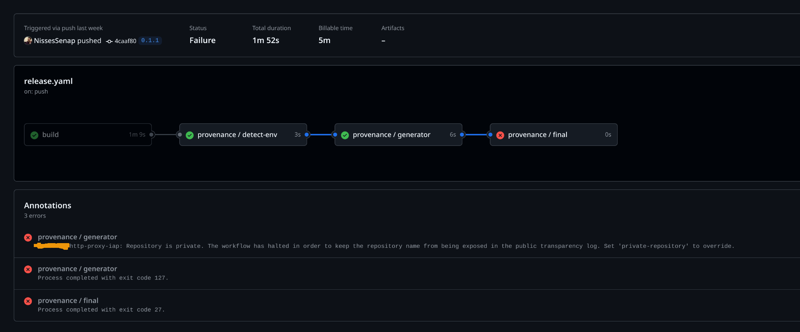

# SBOM, licenses, attestation gathering and visulization

This work is from a 2 day hackathon where I mostly focused on gathering info and performing small PoC.

My goal was to look for tools that can help us sovling the following issues

- Get a hold of CVEs at company
- Show which licenses we use within company (this we allready have a solution for)
- Provenance (build metadata) attesations for artifacts
- Be able to visaulze this data in a good way
- Potentially generate metrics from some of this data

Bellow you will find my thoughts and the differnt tools I have taken a deeper look at.
You can find a rant summary first.

## Summary

In my mind I have realtivly limited scope. I want 1 tool to visaulize CVEs, licesnes, SBOMs and attestations.
I don't need the perfect Secure Software Factory and I just want a relativly easy way to upload our developers container image builds
to generate SBOMs and provenance attestaion and preferably sign them with a private PKI.

In the long run I want to have a admission webhook in Kubernetes that verfies that all my images are signed by the PKI.

I don't want to use the public Sigstore instance due to leakage of internal information, and to me it's kind of strange that any none entreprise solution would.
It's like saying metadata isn't enough to track a human, just ask facebook and google and see what they say about that.
I might have missunderstood Sigstore, and how they see things, but I think it's strange that people don't seem to care.

The open-source space around this is very inmeture, there are a number of ways of projects but it's just a bunch of building blocks and defainlty no fancy UI to visaulize all the data I want to see.

There are a few comapnies that is working hard to solve this, for example Changelog, but they are pricesed out of there minds, well since there customers is the American goverment.
And this applies to all security companies... I have looked at old school solutions as well.
And they want like 60$ a month per user, that is 6 times as much as GitHub costs us, which is something that me as a developer use every single day.
This tool should only be used preferably when I get an alert that I have a bunch of CVEs in my image or I have started to use some stupid license that I don't like.
Even better they create a automatic PR to my repo that bumps my dependcies/container image and those issues are solved.

## in-toto

In-toto is a framework to generate attesations, and it also contains a standard how they should look.
It's part of CNCF and the framework/standard seems to have gotten decent traction.

To store in-toto attesations we could [use](https://github.com/in-toto/archivista), which provides a graphQlL interface
to visaulze how different attesations connect together.
1
I think a SBOM can be in the attesation format, but I also think it's possible to attach attesation to a SBOM, see [CDXA](https://cyclonedx.org/capabilities/attestations/).

The archivista API have no support for managing CVEs and is more or less just a graphQl API infront of a few s3 buckets with a metadata database.
If our goal would have been to attest how a container has been built and being able to verify that with a adminssion webhook in Kubernetes it would work.
But since my focus is both on CVE generation and provenenace then creating a perfect [Secure Software Factory](https://www.chainguard.dev/unchained/secure-your-software-factory-with-melange-and-apko) it's not the correct fit.

## GCP

GCPs SBOM and CVE support have improving allot recently. I looked on it around 1 year ago, and it was more or less worthless.
Today we can atleast view CVEs in the UI in a decent way and can connect SBOM to container images.

### Generate SBOM by KO

To generate SBOM locally using KO

```shell
export KO_DOCKER_REPO=ko.local
ko build --sbom=none --bare --platform linux/amd64 -t http-proxy-iap --image-refs .digest main.go -L
```

To push it to GCP

```shell
export KO_DOCKER_REPO=europe-west1-docker.pkg.dev/foo/sbom-poc/http-proxy-iap
ko build --sbom=none --bare --platform linux/amd64 -t test1 --image-refs .digest main.go
```

To upload a custom SBOM to a specific image.

```shell
gcloud artifacts sbom export --uri=europe-west1-docker.pkg.dev/foo/sbom-poc/http-proxy-iap:test1
```

### Genernera SBOM using cdxgen

```shell
cdxgen -t oci ko.local:5b7b28cfdd64a6217228283bea8e6ca0e7d746c6a770ca88976610ec650b97be -spec-version  1.5


gcloud artifacts sbom load /
--source=bom.json
--uri=europe-west1-docker.pkg.dev/foo/sbom-poc/http-proxy-iap:test1


gcloud artifacts docker images describe europe-west1-docker.pkg.dev/foo/sbom-poc/http-proxy-iap:test1 --show-sbom-references --format json | jq -r '.image_summary.sbom_locations[0]'
```

This will give you an image like this, the problem is that even after I added a new SBOM it don't provide me with more license information.
So even I have complemented the SBOM that was intialy generated the UI don't understand this.

If i remember correctly the initial SBOM that I created was trough the GCP image scanner, but in general we will have removed so much
metadata from the application packages that a image scan won't be able to find that kind of info. That is why I want to add a second SBOM that is generated from application data instead.


I will reach out to my GCP contacts and talk to them if we can get a walktrough of how they see this working and what I'm doing wrong.
How do they see this working in the future?

## Sigstore

I have been in this part of the internet before.
We don't want to sign our artifacts/sbom/attesations with Sigstore since it would leake a bunch of internal info. These tools are built for open-source.

In short we could manage our [own](https://github.com/sigstore/scaffolding) sigtstore instance but it's hard as hell and not worth it.
Also most of the tooling like [SLSA](https://slsa.dev/) don't support custom sigstore isntances.

## GitHub

The enterprise offering of GitHub supports attestation out of the [box](https://docs.github.com/en/actions/security-for-github-actions/using-artifact-attestations/using-artifact-attestations-to-establish-provenance-for-builds).
They also host there own sigstore witch is kind of cool, don't know if it's private per company though.
They have there own attesations [generator](https://github.com/actions/attest-build-provenance).

We could probably also use the private sigstore to sign our images, but I haven't see any information about it.
But on the other hand GiTHub don't provide any UI to visaulze the attesations other then a download list in a hidden part of the GitHub UI.

So I think they are in very early stages, and for CVE managment they mostly lean back on there own CVE system, but what I have seen they don't give a great
overview on a org base. But I might be wrong here.

I don't think it supports container image scannig, and instead focuses on package level, which makes sense from there point of view.
It could be interesting to chat with sales of GitHub and get a good walktrough on what they can do.

## Chainguard

I spoke to them around 1 year ago, and they are extermly expensive and they want around 100$ per node in our k8s clusters.
In short fuck that.

Other then that it seems like that have added more and more features to visaulize CVEs based from SBOM and licenses.
So it would be a great fit for what I would like to use.

## SLSA framework

The SLSA framework is there to help to generate provenance (metadata) attestations, for example from which PR was this build triggerd,
what is the repo this artifact came from etc.

The problem for me is that they rely on Sigstore to sign all the generated attestations, and If you set don't sign at sigstore the job fails.



and when I checked I can't find any config that is skip if it fails generate the attestation for me and put it in this file.
I will handle uploading it. My guess this is because the want to reach higher [SLSA levels](https://slsa.dev/spec/v1.0/levels).

There is a way to build your own SLSA action [BYOB](https://github.com/slsa-framework/slsa-github-generator/blob/main/BYOB.md).
And I found a walktrough presentation from [packagingCon 2023](https://www.youtube.com/watch?v=2ylWiUokBRw&ab_channel=PackagingCon) about it.
So together with this it should be possible to get rid of the stupid fail if you don't use Sigstore.

There are issues open about supporting private [PKI](https://github.com/slsa-framework/slsa-github-generator/issues/34)
and [private Sigstore](https://github.com/slsa-framework/slsa-github-generator/issues/3607). But nothing has happened on them.

## Dependecy Track (DT)

So this is the most meture soltuion in the open-source world that I can find.

- It scans SBOMs and generate CVE reports from it
- You can upload SBOMs and read them

Sadly it don't support

- Signing of artifact (nothing I want right now but in the future we do)
- License support there
- [Attestation](https://github.com/DependencyTrack/dependency-track/issues/651) support is missing

But they have a policy engine and slack integration.
But the project will probably never solve everything I want. They are currently working towards making DT more operations friednly with the [hyades](https://github.com/DependencyTrack/hyades/) project.
Witch will make DT decent in a Kubernetes env, and support better scale (IBM is a big bagger of DT).
But they have been working on hyades and they are scope creeping delux and it never gets merged in to DT it self. So I don't expect any miracles any time soon.

## Genaerting SBOM

I recently started playing with how to generate SBOMs and as everyting else it's a jungle.
I'm focusing on CycloneDX since im mostly leaning towards using DT.

Sadly different tools interpet data differnetly, for example [components.type](https://cyclonedx.org/docs/1.6/json/#components_items_type) are both framework or library.
For example [https://github.com/CycloneDX/cdxgen](https://github.com/CycloneDX/cdxgen) generates a SBOM that uses framework.

While [https://github.com/CycloneDX/cyclonedx-gomod](https://github.com/CycloneDX/cyclonedx-gomod), uses library, when they both are built on the go files.

I have uploaded some raw SBOM files to look at here in a [PR](https://github.com/NissesSenap/sbom-api/pull/8) where i play around.

### Summarize

I think it's resonable that you should generate two SBOMs per application, once for your container and once for your programming language.
There is probably some decent way of ignoring all the package info from your app in the container, so you don't get dupilicate app info, with different info.
If not, probably just use `jq` to remove a bunch of stuff from yor app in the container SBOM and then use cyclonedx to merge them.

### cdxgen

```shell
cdxgen -t golang -o go-bom.json .
```

### cdxgen container image

```shell
export KO_DOCKER_REPO=ko.local
ko build --sbom=none --bare --platform linux/amd64 -t test1 --image-refs .digest main.go

# tell cdxgen to gather licenses from the generated docker artifact
export FETCH_LICENSE=true
cdxgen -t oci ko.local:5b7b28cfdd64a6217228283bea8e6ca0e7d746c6a770ca88976610ec650b97be -spec-version  1.6 -o container-bom.json
```

### cyclonedx-gomod

Using this command I was able to find the version.

```shell
cyclonedx-gomod app  -json -output gomod.bom.json -packages -files -licenses -main cmd/sbom-api/
```

### cyclonedx merge and diff

Merge can be used to put multiple SBOM together, which is useful. But make sure that they contain different info.
For example the merge tool can't handle similar pickages but not exact, so when I used cyclonedx-gomod and cdxgen that was built on my go packages.
And it wasnt able to merge the different components in a good way.

```shell
# merge
cyclonedx merge --input-files gomod.bom.json container-bom.json  --output-file merged.json
```

You could think that diff is used to compare different component output and similar stuff.
But it's more or less just to compare package versions, using component-versions.

```shell
# diff
$ cyclonedx diff go-bom-version1.json go-bom-version2.json --output-format text --component-versions
Component versions that have changed:
-  golang.org/x/text @ v0.21.0
+  golang.org/x/text @ v0.21.1
```

So could be useful if you don't have something like DT.

## Minder

[Minder](https://mindersec.dev/) is a part of [OpenSSF](https://openssf.org/blog/2024/10/28/openssf-adds-minder-as-a-sandbox-project-to-simplify-the-integration-and-use-of-open-source-security-tools/)
as a sandbox project. It doesen't have anything to do with SBOM, but it's an interesting tool

It can be used to setup best practices for your GitHub org, anad they more or less listens to all events from GitHub.
They also have a cloud solution but no prizing info, the creators of the software is one of the creator of Sigstore and Kubernetes, so they know there stuff.
